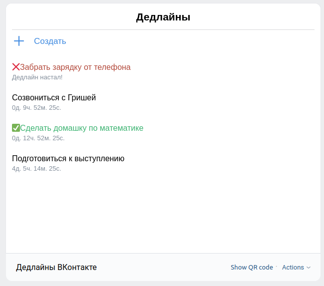
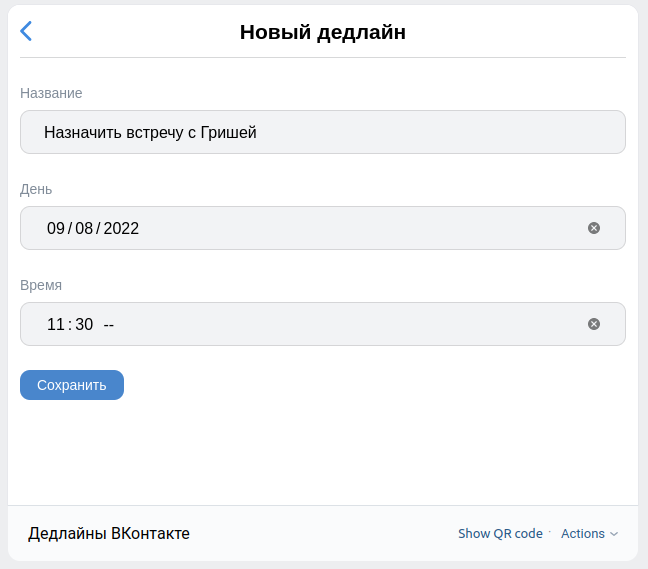
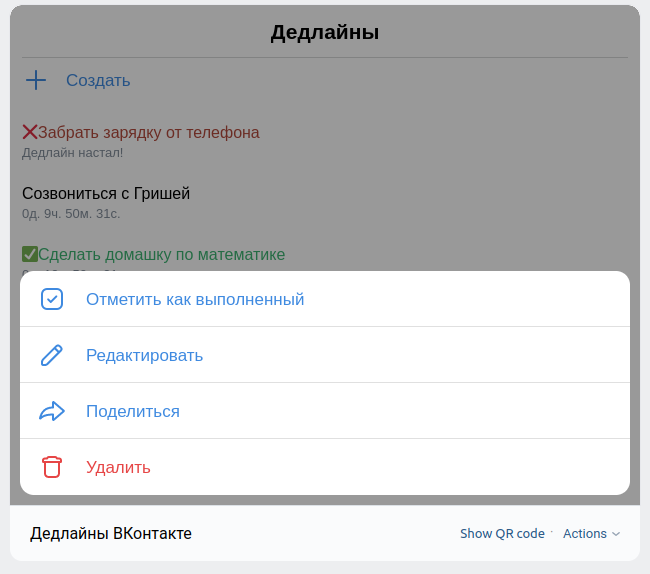

## Overview
VK Deadlines - an application which helps people to manage their time. Online TODO-list with timer. 


- List of timers:




- Create a new timer:




- Choosing of element:




## Developing
For developing I used React JS, VKBridge and VKUI

Deploy project:
```
npm run deploy
```

Local run (app will start at `localhost:10888`):
```
npm start
```
